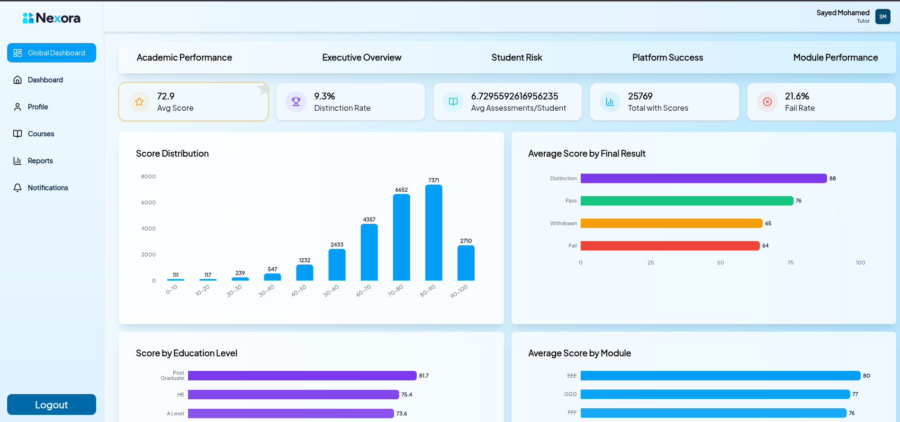
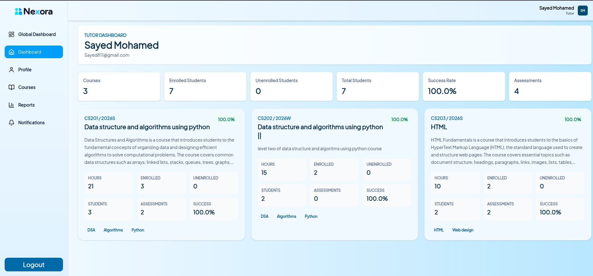
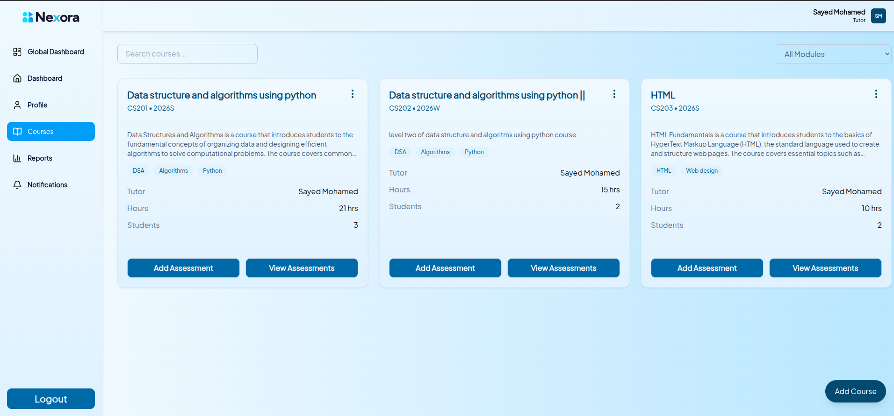
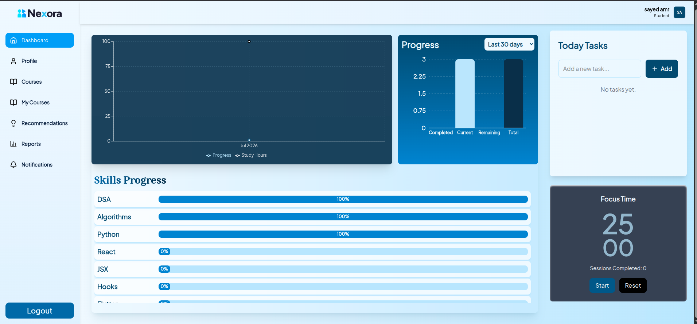
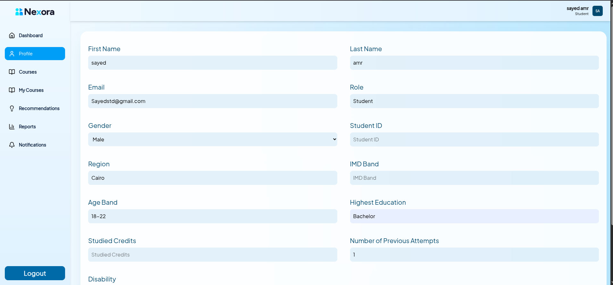
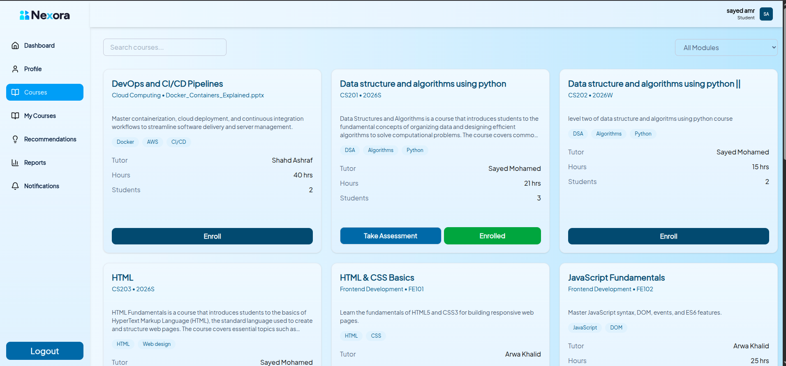
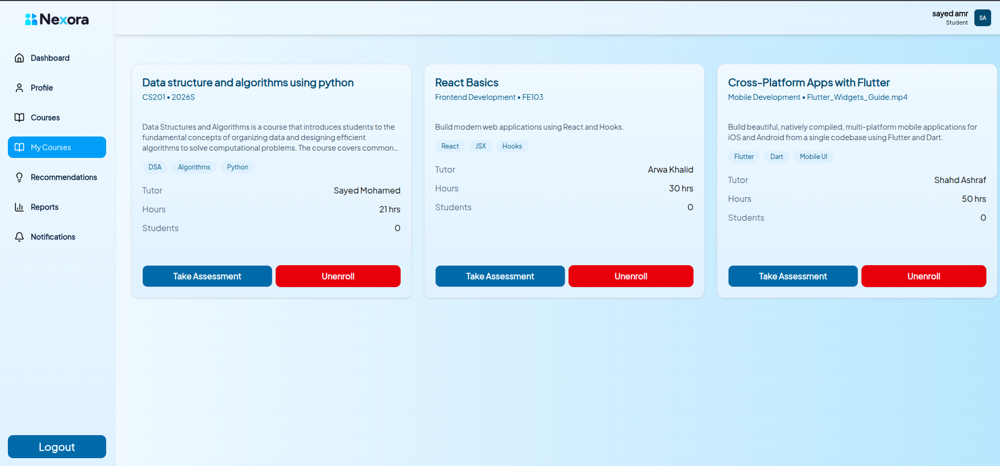
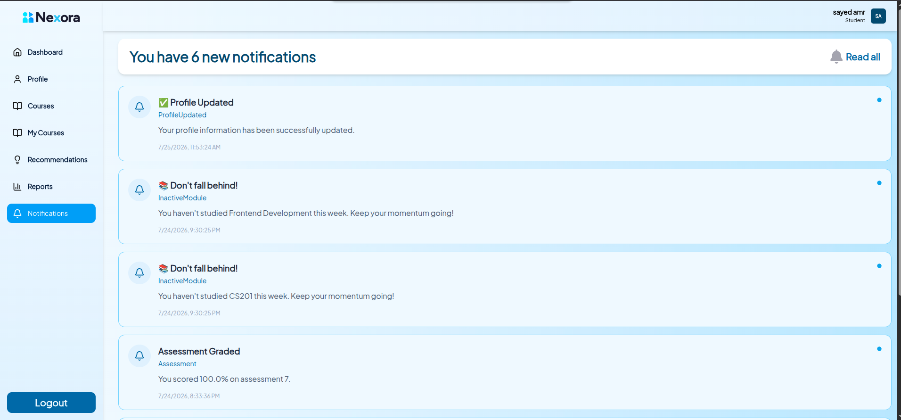
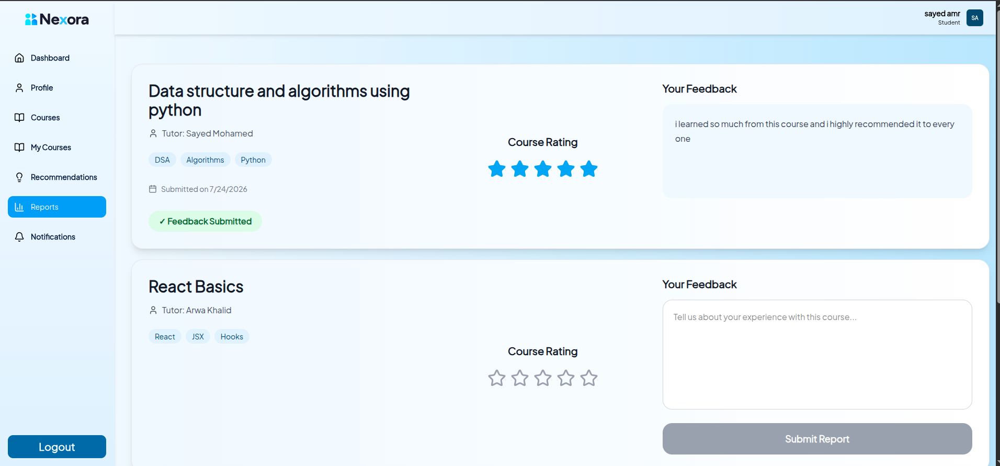

# Welcome To Nexora 

Nexora is a modern student performance analytics platform designed to help students to monitor learning progress, analyze performance, and make data-driven decisions.

## Overview

Traditional learning platforms often provide grades without meaningful insights. Nexora transforms academic data into clear visual analytics, helping users understand performance trends, identify strengths and weaknesses, and improve learning outcomes.

## Features

- Secure Authentication (Login & Register)
- Interactive Analytics Dashboard
- Student Performance Visualization
- Academic Progress Tracking
- Student Management
- Course Management
- Assessment Analysis
- Performance Reports
- Responsive User Interface
- Modern and Clean Design

## Tech Stack

### Frontend
- React
- Vite
- Tailwind CSS
- React Router
- Axios

### Backend
- ASP.NET Core 8 Web API
- JWT Authentication & Authorization
- SignalR
- Entity Framework Core
- SQL Server
- Layered Architecture (3-Tier / N-Tier)


### Tools
- Git & GitHub
- Swagger / OpenAPI Documentation
- Visual Studio
- VS Code

## 📂 Project Structure

```
Nexora
│
├── frontend/          # React application
│
├── Backend/
│   └── NexoraAPI/     # ASP.NET Core Web API
│
└── README.md
```

## Installation

### Clone the repository

```bash
git clone https://github.com/your-username/Nexora.git
```

### Frontend

```bash
cd frontend
npm install
npm run dev
```

### Backend

```bash
cd Backend/NexoraAPI
dotnet restore
dotnet build
dotnet run
```

## Project Goals

- Improve student academic performance through data analysis.
- Help educators identify students who need additional support.
- Provide interactive dashboards for better decision-making.
- Make educational analytics accessible and easy to understand.


## Screenshots


## Tutor interface 

### global dashboard to monitor all students progress


### cusomized dashboard to monitor only the students that enrolled in your course as a tutor


### manage your courses 


### and many other features you can discover as a tutor in our platform 

## Student interface

### customized dashboard to manage your progress


### your profile 


### all the courses which you can enroll to any one you want


### the courses you enrolled in 


### Notification page for remind you always


### make reports and rate the courses as much as you want 



## License
This project is intended for educational purposes.
